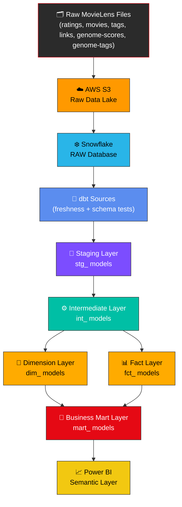
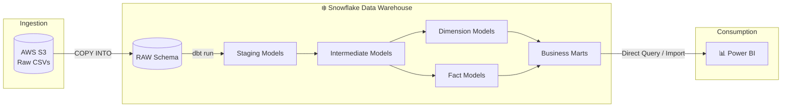
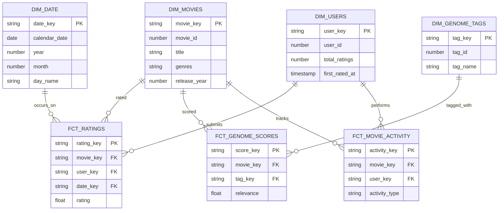
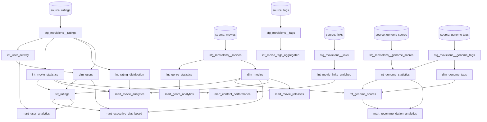

<div align="center">

# 🎬 Enterprise Netflix Analytics Engineering Pipeline

### Production-Grade Analytics Engineering built on AWS S3 → Snowflake → dbt Core

*A star-schema data warehouse powering executive, movie, user, genre, and recommendation analytics — modeled end-to-end using industry-standard Analytics Engineering practices.*

<br/>

[](https://www.getdbt.com/)
[](https://www.snowflake.com/)
[](https://aws.amazon.com/s3/)
[](#)
[](#-license)

<br/>

[](#-project-statistics)
[](#-data-quality-framework)
[](#-project-statistics)
[](#-business-marts)
[](#)

<br/>

**[Architecture](#-enterprise-architecture) · [Data Model](#-data-warehouse-design) · [Setup](#-installation-guide) · [Testing](#-data-quality-framework--testing-strategy) · [Author](#-author)**

</div>

<br/>

---

## 📖 Table of Contents

<details>
<summary><strong>Click to expand full table of contents</strong></summary>

- [Project Overview](#-project-overview)
- [Why This Project](#-why-this-project)
- [Enterprise Architecture](#-enterprise-architecture)
- [Data Flow Diagram](#-data-flow-diagram)
- [Complete Folder Structure](#-complete-folder-structure)
- [Technology Stack](#-technology-stack)
- [Model Layer Explanation](#-model-layer-explanation)
- [Data Warehouse Design](#-data-warehouse-design)
- [Star Schema Diagram](#-star-schema-diagram)
- [Business Marts](#-business-marts)
- [Dimension Tables](#-dimension-tables)
- [Fact Tables](#-fact-tables)
- [Intermediate Models](#-intermediate-models)
- [Data Lineage](#-data-lineage)
- [Data Quality Framework & Testing Strategy](#-data-quality-framework--testing-strategy)
- [Project Statistics](#-project-statistics)
- [Installation Guide](#-installation-guide)
- [AWS S3 Setup](#-aws-s3-setup)
- [Snowflake Setup](#-snowflake-setup)
- [dbt Setup](#-dbt-setup)
- [Project Execution Commands](#-project-execution-commands)
- [dbt Commands Reference](#-dbt-commands-reference)
- [Documentation & dbt Docs](#-documentation--dbt-docs)
- [Screenshots](#-screenshots)
- [Key Engineering Concepts](#-key-engineering-concepts)
- [Learning Outcomes](#-learning-outcomes)
- [Future Enhancements](#-future-enhancements)
- [Resume Highlights](#-resume-highlights)
- [Contribution Guidelines](#-contribution-guidelines)
- [License](#-license)
- [Author](#-author)
- [Connect With Me](#-connect-with-me)

</details>

---

## 🧩 Project Overview

The **Enterprise Netflix Analytics Engineering Pipeline** is a full-scale, production-style Analytics Engineering project built on the **MovieLens dataset**, engineered to replicate how a real streaming platform would structure its analytics warehouse.

Raw rating, tagging, and metadata files are landed in **AWS S3**, loaded into **Snowflake**, and transformed through a disciplined **dbt Core** pipeline that moves data through **Staging → Intermediate → Dimension → Fact → Business Mart** layers — culminating in a **Power BI–ready semantic layer**.

This isn't a notebook-driven exploratory project. It is modeled the way analytics engineering teams at streaming, subscription, and media companies actually build warehouses: **version-controlled, tested, documented, and modular.**

> 🎯 **Core Objective:** Demonstrate mastery of modern Analytics Engineering — dimensional modeling, incremental processing, data quality enforcement, and semantic layer design — using dbt best practices end-to-end.

---

## 💡 Why This Project

| Challenge in Raw Analytics | How This Pipeline Solves It |
|---|---|
| Messy, ungoverned source data | Dedicated **staging layer** standardizes types, names, and grain before any business logic touches the data |
| Duplicated business logic across dashboards | Centralized **intermediate layer** computes reusable metrics once, referenced everywhere |
| No single source of truth for KPIs | **Business mart layer** exposes governed, tested, documented tables mapped directly to stakeholder questions |
| Silent data quality failures | **143 automated tests** run on every build — generic, relationship, and custom business-rule tests |
| Poor change tracking on evolving records | **Snapshots** capture slowly changing dimensions with full historical fidelity |
| Undocumented, tribal-knowledge pipelines | **Enterprise YAML documentation** + auto-generated **dbt Docs** with full lineage graphs |
| Slow, non-scalable full refreshes | **Incremental models** process only new/changed data on scheduled runs |

---

## 🏗️ Enterprise Architecture



The architecture strictly follows the **medallion-inspired, dbt-native layering pattern**:

1. **Source Layer** — Raw MovieLens CSVs (`ratings`, `movies`, `tags`, `links`, `genome-scores`, `genome-tags`) landed in S3 and loaded into Snowflake's `RAW` database via external stages.
2. **Staging Layer** — 1:1 cleaned representations of source tables. No joins, no business logic — just type casting, renaming, and null handling.
3. **Intermediate Layer** — Reusable business logic: aggregations, statistics, and derived metrics that multiple downstream models depend on.
4. **Dimension Layer** — Conformed, descriptive entities (`dim_movies`, `dim_users`, `dim_date`, `dim_genome_tags`) with surrogate keys.
5. **Fact Layer** — Transactional and event-grain tables (`fct_ratings`, `fct_genome_scores`, `fct_movie_activity`) joined to dimensions via surrogate keys.
6. **Business Mart Layer** — Denormalized, stakeholder-facing tables purpose-built for BI consumption.

---

## 🔄 Data Flow Diagram



---

## 📂 Complete Folder Structure

```
netflix_analytics_engineering/
│
├── models/
│   ├── staging/
│   │   ├── movielens/
│   │   │   ├── _movielens__sources.yml
│   │   │   ├── _movielens__models.yml
│   │   │   ├── stg_movielens__ratings.sql
│   │   │   ├── stg_movielens__movies.sql
│   │   │   ├── stg_movielens__tags.sql
│   │   │   ├── stg_movielens__links.sql
│   │   │   ├── stg_movielens__genome_scores.sql
│   │   │   └── stg_movielens__genome_tags.sql
│   │
│   ├── intermediate/
│   │   ├── _intermediate__models.yml
│   │   ├── int_movie_statistics.sql
│   │   ├── int_movie_popularity.sql
│   │   ├── int_movie_engagement.sql
│   │   ├── int_movie_tags_aggregated.sql
│   │   ├── int_movie_links_enriched.sql
│   │   ├── int_user_activity.sql
│   │   ├── int_rating_distribution.sql
│   │   ├── int_genre_statistics.sql
│   │   └── int_genome_statistics.sql
│   │
│   ├── marts/
│   │   ├── core/
│   │   │   ├── _core__models.yml
│   │   │   ├── dim_movies.sql
│   │   │   ├── dim_users.sql
│   │   │   ├── dim_date.sql
│   │   │   ├── dim_genome_tags.sql
│   │   │   ├── fct_ratings.sql
│   │   │   ├── fct_genome_scores.sql
│   │   │   └── fct_movie_activity.sql
│   │   │
│   │   └── business/
│   │       ├── _business__models.yml
│   │       ├── mart_executive_dashboard.sql
│   │       ├── mart_movie_analytics.sql
│   │       ├── mart_user_analytics.sql
│   │       ├── mart_genre_analytics.sql
│   │       ├── mart_recommendation_analytics.sql
│   │       ├── mart_content_performance.sql
│   │       └── mart_movie_releases.sql
│   │
├── snapshots/
│   └── snap_movies_scd.sql
│
├── seeds/
│   └── genre_reference.csv
│
├── macros/
│   ├── generate_surrogate_key.sql
│   ├── test_positive_value.sql
│   └── get_custom_schema.sql
│
├── analyses/
│   └── adhoc_rating_trends.sql
│
├── tests/
│   └── generic/
│       └── assert_rating_within_bounds.sql
│
├── dbt_project.yml
├── packages.yml
├── profiles.yml.example
├── README.md
└── .gitignore
```

---

## 🛠️ Technology Stack

| Layer | Technology | Purpose |
|---|---|---|
| **Storage / Data Lake** | AWS S3 | Landing zone for raw MovieLens CSV files |
| **Data Warehouse** | Snowflake | Cloud-native compute + storage for all transformation layers |
| **Transformation** | dbt Core | SQL + Jinja-based modeling, testing, documentation |
| **Templating** | Jinja | Dynamic SQL generation, macros, DRY logic |
| **Modeling Pattern** | Star Schema | Dimensional modeling for BI performance |
| **Version Control** | Git & GitHub | Source control, collaboration, CI-ready structure |
| **BI / Visualization** | Power BI | Executive and operational dashboards on top of marts |
| **Query Language** | SQL | Core transformation logic across every layer |

---

## 🧱 Model Layer Explanation

<details>
<summary><strong>🔹 Staging Layer — `stg_movielens__*`</strong></summary>

<br/>

Staging models are the **contract between raw source data and the warehouse**. Each model:
- Maps 1:1 to a single source table
- Performs type casting, column renaming, and null standardization
- Contains **zero joins and zero business logic**
- Is materialized as a `view` for low storage overhead

```sql
-- stg_movielens__ratings.sql (excerpt)
with source as (
    select * from {{ source('movielens', 'ratings') }}
),

renamed as (
    select
        user_id::number         as user_id,
        movie_id::number        as movie_id,
        rating::float           as rating,
        to_timestamp(timestamp) as rated_at
    from source
)

select * from renamed
```

</details>

<details>
<summary><strong>🔹 Intermediate Layer — `int_*`</strong></summary>

<br/>

Intermediate models hold **reusable business logic** — aggregations and derived metrics consumed by multiple downstream dimension, fact, or mart models. Keeping this logic centralized avoids duplicating the same `GROUP BY` across five different marts.

Includes: `int_movie_statistics`, `int_movie_popularity`, `int_movie_engagement`, `int_movie_tags_aggregated`, `int_movie_links_enriched`, `int_user_activity`, `int_rating_distribution`, `int_genre_statistics`, `int_genome_statistics`.

</details>

<details>
<summary><strong>🔹 Dimension Layer — `dim_*`</strong></summary>

<br/>

Dimension models describe the **"who, what, where"** of the business — conformed entities with surrogate keys, generated using `dbt_utils.generate_surrogate_key`, ensuring stable joins even when natural keys drift.

</details>

<details>
<summary><strong>🔹 Fact Layer — `fct_*`</strong></summary>

<br/>

Fact models capture **measurable events** at a defined grain (one row per rating, one row per genome score) and join out to dimensions strictly via surrogate keys — never natural keys.

</details>

<details>
<summary><strong>🔹 Business Mart Layer — `mart_*`</strong></summary>

<br/>

Marts are **denormalized, wide, stakeholder-facing tables** designed to answer specific business questions with minimal joins required at the BI layer — optimized for Power BI's import/DirectQuery performance.

</details>

---

## 🗄️ Data Warehouse Design

The warehouse follows a **Kimball-style star schema**, chosen specifically for its query simplicity and BI-tool compatibility over a fully normalized (Inmon-style) design.

| Design Principle | Implementation |
|---|---|
| **Grain definition** | Explicitly documented per fact table (e.g., `fct_ratings` = one row per user-movie rating event) |
| **Surrogate keys** | Every dimension and fact uses hashed surrogate keys, decoupling the warehouse from source-system key changes |
| **Conformed dimensions** | `dim_movies`, `dim_users`, `dim_date` are shared consistently across all fact tables |
| **Slowly Changing Dimensions** | `snap_movies_scd` snapshot tracks historical changes to movie metadata over time (Type 2 SCD) |
| **Denormalization at the mart layer** | Business marts intentionally flatten star-schema joins for BI performance |

---

## ⭐ Star Schema Diagram



---

## 💼 Business Marts

| Mart | Business Question Answered |
|---|---|
| 🎯 **Executive Dashboard** | What are the top-line KPIs — total ratings, active users, catalog size, average rating trend? |
| 🎬 **Movie Analytics** | Which movies are top-rated, most-watched, and trending by genre and era? |
| 👥 **User Analytics** | Who are the most engaged users, and what does their rating behavior look like over time? |
| 🎭 **Genre Analytics** | Which genres dominate engagement, and how does genre preference shift over time? |
| 🤖 **Recommendation Analytics** | How do genome tag relevance scores correlate with actual user ratings? |
| 📈 **Content Performance** | How does each title perform across popularity, engagement, and rating-quality dimensions? |
| 🆕 **Movie Releases** | How does release-year cohort performance compare across the catalog? |

---

## 📐 Dimension Tables

| Dimension | Grain | Key Attributes |
|---|---|---|
| `dim_movies` | One row per movie | `movie_key`, title, genres, release year |
| `dim_users` | One row per user | `user_key`, total ratings, first/last activity |
| `dim_date` | One row per calendar day | `date_key`, year, month, quarter, day name |
| `dim_genome_tags` | One row per genome tag | `tag_key`, tag name, tag category |

## 📊 Fact Tables

| Fact | Grain | Measures |
|---|---|---|
| `fct_ratings` | One row per user-movie rating event | `rating` |
| `fct_genome_scores` | One row per movie-tag relevance pairing | `relevance` |
| `fct_movie_activity` | One row per user-movie interaction event | `activity_type`, `activity_count` |

## ⚙️ Intermediate Models

| Model | Purpose |
|---|---|
| `int_movie_statistics` | Aggregated rating count, average, and variance per movie |
| `int_movie_popularity` | Popularity scoring blending rating volume and recency |
| `int_movie_engagement` | Combined tag + rating + link engagement signal per movie |
| `int_movie_tags_aggregated` | User-generated tags consolidated per movie |
| `int_movie_links_enriched` | External ID links (IMDb/TMDb) enriched per movie |
| `int_user_activity` | Per-user rating counts, averages, and activity span |
| `int_rating_distribution` | Rating value distribution buckets across the catalog |
| `int_genre_statistics` | Genre-level aggregated rating and volume statistics |
| `int_genome_statistics` | Tag relevance aggregation across the genome scoring set |

---

## 🔗 Data Lineage



> 💡 Full interactive lineage is available via `dbt docs generate && dbt docs serve` — see [Documentation & dbt Docs](#-documentation--dbt-docs).

---

## ✅ Data Quality Framework & Testing Strategy

This project enforces data quality with **143 automated tests** spanning four categories:

| Test Type | Count (approx.) | Examples |
|---|---|---|
| **Generic (built-in dbt)** | `not_null`, `unique` | Applied to every primary/surrogate key across 30 models |
| **Relationship Tests** | `relationships` | Every foreign key in `fct_ratings`, `fct_genome_scores`, `fct_movie_activity` validated against its parent dimension |
| **Accepted Values** | `accepted_values` | Rating bounds, activity type enums, genre category checks |
| **Custom Business Tests** | Singular tests | `assert_rating_within_bounds` — ensures no rating falls outside the valid 0.5–5.0 MovieLens scale |

```yaml
# Example from _core__models.yml
models:
  - name: fct_ratings
    description: "One row per user-movie rating event."
    columns:
      - name: rating_key
        tests: [not_null, unique]
      - name: movie_key
        tests:
          - not_null
          - relationships:
              to: ref('dim_movies')
              field: movie_key
      - name: rating
        tests:
          - accepted_values:
              values: [0.5, 1.0, 1.5, 2.0, 2.5, 3.0, 3.5, 4.0, 4.5, 5.0]
```

```sql
-- tests/generic/assert_rating_within_bounds.sql
select *
from {{ ref('fct_ratings') }}
where rating < 0.5 or rating > 5.0
```

**Testing philosophy applied here:**
- Tests run on **every model build**, not as an afterthought — `dbt build` fails fast on quality violations
- Source freshness checks flag stale S3 → Snowflake loads before they poison downstream marts
- Contracts are enforced on fact tables to guarantee schema stability for BI consumers

---

## 📊 Project Statistics

<div align="center">

| Metric | Count |
|---|---|
| 🧱 **Total dbt Models** | 30 |
| 🗂️ **Source Tables** | 6 |
| 🌱 **Seeds** | 1 |
| 📸 **Snapshots** | 1 |
| ✅ **Data Tests** | 143 |
| 💼 **Business Marts** | 7 |
| 📐 **Dimension Models** | 4 |
| 📊 **Fact Models** | 3 |
| ⚙️ **Intermediate Models** | 9 |
| 🧹 **Staging Models** | 6 |

</div>

---

## 🚀 Installation Guide

### Prerequisites

- Python 3.9+
- An AWS account with S3 access
- A Snowflake account (trial account works)
- Git

```bash
# Clone the repository
git clone https://github.com/data-analyst-harsh-soni/enterprise-netflix-dbt-analytics
.git
cd netflix-analytics-engineering

# Create and activate a virtual environment
python -m venv venv
source venv/bin/activate        # Windows: venv\Scripts\activate

# Install dbt Core with the Snowflake adapter
pip install dbt-snowflake
```

---

## ☁️ AWS S3 Setup

```bash
# 1. Create an S3 bucket for raw MovieLens files
aws s3 mb s3://netflix-analytics-raw-data

# 2. Upload the MovieLens dataset
aws s3 cp ./data/ml-latest/ s3://netflix-analytics-raw-data/movielens/ --recursive

# 3. Verify upload
aws s3 ls s3://netflix-analytics-raw-data/movielens/
```

Configure an IAM policy granting Snowflake's storage integration `s3:GetObject` and `s3:ListBucket` permissions scoped to this bucket only.

---

## ❄️ Snowflake Setup

```sql
-- 1. Create warehouse, database, and schemas
CREATE WAREHOUSE IF NOT EXISTS netflix_wh
  WAREHOUSE_SIZE = 'XSMALL'
  AUTO_SUSPEND = 60
  AUTO_RESUME = TRUE;

CREATE DATABASE IF NOT EXISTS netflix_analytics;

CREATE SCHEMA IF NOT EXISTS netflix_analytics.raw;
CREATE SCHEMA IF NOT EXISTS netflix_analytics.staging;
CREATE SCHEMA IF NOT EXISTS netflix_analytics.intermediate;
CREATE SCHEMA IF NOT EXISTS netflix_analytics.marts;

-- 2. Create a storage integration to S3
CREATE STORAGE INTEGRATION s3_netflix_integration
  TYPE = EXTERNAL_STAGE
  STORAGE_PROVIDER = 'S3'
  ENABLED = TRUE
  STORAGE_AWS_ROLE_ARN = '<your-iam-role-arn>'
  STORAGE_ALLOWED_LOCATIONS = ('s3://netflix-analytics-raw-data/movielens/');

-- 3. Create external stage and load raw tables
CREATE STAGE netflix_analytics.raw.movielens_stage
  STORAGE_INTEGRATION = s3_netflix_integration
  URL = 's3://netflix-analytics-raw-data/movielens/'
  FILE_FORMAT = (TYPE = CSV, SKIP_HEADER = 1);

COPY INTO netflix_analytics.raw.ratings
  FROM @netflix_analytics.raw.movielens_stage/ratings.csv;
```

---

## 🧰 dbt Setup

```yaml
# profiles.yml
netflix_analytics_engineering:
  target: dev
  outputs:
    dev:
      type: snowflake
      account: "<your_account_id>"
      user: "<your_username>"
      password: "<your_password>"
      role: TRANSFORMER
      database: netflix_analytics
      warehouse: netflix_wh
      schema: dbt_dev
      threads: 4
```

```bash
# Verify the connection
dbt debug

# Install package dependencies (dbt_utils, etc.)
dbt deps
```

```yaml
# packages.yml
packages:
  - package: dbt-labs/dbt_utils
    version: [">=1.1.0", "<2.0.0"]
```

---

## ▶️ Project Execution Commands

```bash
# Full pipeline build (models + snapshots + seeds + tests)
dbt build

# Run models only
dbt run

# Run models for a specific layer
dbt run --select staging
dbt run --select intermediate
dbt run --select marts

# Run and test a single mart with all its upstream dependencies
dbt build --select +mart_executive_dashboard

# Run incremental models with full-refresh
dbt run --select fct_ratings --full-refresh
```

---

## 📘 dbt Commands Reference

| Command | Description |
|---|---|
| `dbt run` | Executes all models in dependency order |
| `dbt test` | Runs all schema + custom tests |
| `dbt build` | Runs models, tests, seeds, and snapshots together |
| `dbt seed` | Loads CSV seed files (e.g., `genre_reference.csv`) into the warehouse |
| `dbt snapshot` | Executes SCD snapshot logic for `snap_movies_scd` |
| `dbt compile` | Compiles Jinja SQL to raw SQL without executing |
| `dbt docs generate` | Generates documentation site + lineage graph |
| `dbt docs serve` | Serves documentation locally |
| `dbt source freshness` | Checks staleness of raw source tables |
| `dbt clean` | Removes compiled artifacts and package installs |

---

## 📚 Documentation & dbt Docs

Every model, column, and source in this project is documented via enterprise-grade YAML files (`_movielens__models.yml`, `_core__models.yml`, `_business__models.yml`), including descriptions, tests, and tags.

```bash
# Generate and serve interactive documentation with full lineage graph
dbt docs generate
dbt docs serve --port 8080
```

This launches a searchable site with:
- 📖 Column-level descriptions for all 30 models
- 🔗 Full interactive DAG / lineage explorer
- 🏷️ Model tags (`staging`, `intermediate`, `core`, `mart`) for filtered navigation
- 🧪 Test coverage visibility per model

---

## 🖼️ Screenshots

<div align="center">

| dbt DAG / Lineage Graph | Power BI Executive Dashboard |
|---|---|
| *Add screenshot: `docs/images/dbt-dag.png`* | *Add screenshot: `docs/images/powerbi-dashboard.png`* |

| Snowflake Query Profile | dbt Test Run Summary |
|---|---|
| *Add screenshot: `docs/images/snowflake-query.png`* | *Add screenshot: `docs/images/dbt-test-results.png`* |

</div>

---

## 🧠 Key Engineering Concepts

- **Medallion-inspired layering** — strict one-directional data flow from staging → mart, no downstream-to-upstream references
- **Surrogate key generation** — `dbt_utils.generate_surrogate_key()` used consistently to decouple warehouse keys from source system IDs
- **Incremental materialization** — high-volume fact tables (`fct_ratings`) use `is_incremental()` logic to avoid full-table reprocessing
- **Slowly Changing Dimensions (Type 2)** — `snap_movies_scd` preserves historical states of movie metadata with `dbt_valid_from` / `dbt_valid_to`
- **Contracts & tags** — enforced column-level contracts on fact tables to guarantee schema stability for BI consumers
- **DRY transformation logic** — shared logic abstracted into macros (`generate_surrogate_key.sql`, `get_custom_schema.sql`)
- **Test-driven transformation** — 143 tests treated as CI gates, not optional documentation

---

## 🎓 Learning Outcomes

Building this project required (and reinforced) hands-on mastery of:

- ✅ Dimensional modeling theory (Kimball star schema) applied to a real, messy dataset
- ✅ Writing modular, DRY SQL using Jinja templating and dbt macros
- ✅ Designing and enforcing a multi-layer data quality testing strategy
- ✅ Managing SCD Type 2 history using dbt snapshots
- ✅ Structuring a dbt project the way production analytics engineering teams do
- ✅ Cloud data warehouse administration (Snowflake warehouses, roles, storage integrations)
- ✅ Building a cloud-native ingestion path from AWS S3 into Snowflake
- ✅ Translating a raw dataset into stakeholder-ready BI marts

---

## 🔮 Future Enhancements

- [ ] Orchestrate scheduled runs with **Airflow** (`dbt run` + `dbt test` as DAG tasks)
- [ ] Add **CI/CD** via GitHub Actions to run `dbt build` on every pull request
- [ ] Introduce **dbt unit tests** for complex intermediate transformation logic
- [ ] Add **exposures** in dbt to formally document downstream Power BI dashboard dependencies
- [ ] Implement **column-level lineage** tagging for PII/sensitive fields
- [ ] Add a **semantic layer** using dbt Semantic Layer / MetricFlow for governed metric definitions
- [ ] Extend the genome-based recommendation mart into a lightweight collaborative-filtering feature store

---

## 📄 Resume Highlights

> Use these as bullet points for resumes, portfolios, and LinkedIn:

- Engineered a **30-model, 6-layer dbt pipeline** (staging → intermediate → dimension → fact → mart) on **Snowflake**, ingesting raw data from **AWS S3**
- Designed a **Kimball star schema** with 4 conformed dimensions and 3 fact tables, using surrogate keys for warehouse-source decoupling
- Implemented **143 automated data quality tests** (generic, relationship, and custom business-rule tests), enforced via `dbt build` as a CI-style quality gate
- Built **7 stakeholder-facing business marts** (executive, movie, user, genre, recommendation, content performance, releases) consumed directly by **Power BI**
- Implemented **Type 2 Slowly Changing Dimension** tracking via dbt snapshots for full historical auditability of movie metadata
- Authored enterprise-grade **YAML documentation** and generated an interactive **dbt Docs lineage graph** covering the entire pipeline

---

## 🤝 Contribution Guidelines

Contributions, issues, and feature requests are welcome!

1. Fork the repository
2. Create a feature branch: `git checkout -b feature/your-feature-name`
3. Commit your changes: `git commit -m "Add: your feature description"`
4. Ensure `dbt build` passes with zero test failures
5. Push to your branch and open a Pull Request

Please follow the existing naming conventions (`stg_`, `int_`, `dim_`, `fct_`, `mart_`) and add YAML documentation + tests for any new model.

---

## 📜 License

This project is licensed under the **MIT License** — see the [LICENSE](LICENSE) file for details.

---

<div align="center">

## 👨‍💻 Author

**Harsh Soni**

Tech Director @ The Entrepreneurship Network (TEN) · Final-Year B.Tech CSE, GGITS Jabalpur

Analytics Engineer & Data Analyst specializing in SQL, Python, dbt, Snowflake, and Power BI

<br/>

## 🔗 Connect With Me

[](https://github.com/data-analyst-harsh-soni)
[]([https://linkedin.com](https://in.linkedin.com/in/harsh-soni-data-analyst))

<br/>

### ⭐ If this project helped you understand Analytics Engineering, consider giving it a star!

<br/>

---

<sub>Built with ❄️ Snowflake, 🛠️ dbt Core, and ☁️ AWS S3 — engineered for production, documented for learning.</sub>

</div>
